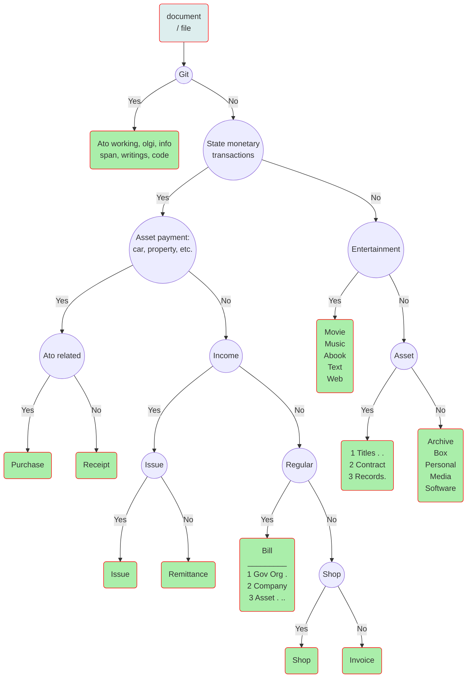

```mermaid
graph TD
doc(document<br/>/ file) --> isgit((Git))

isgit -- Yes --> git(Ato working, olgi, info<br/>span, writings, code)

isgit -- No --> mention((State monetary<br/> transactions))

mention -- Yes --> payment((Asset payment: <br/>car, property, etc.<br/><on balance><br/><capital>))
mention -- No --> enter((Entertainment))

payment -- Yes --> ato((Ato related))
payment -- No --> income((Income))

ato -- Yes --> ato2(Purchase)
ato -- No --> receipt(Receipt)

income -- Yes --> isissue((Issue))

isissue -- Yes --> issue(Issue)
isissue -- No -->remit(Remittance)
income -- No --> regular((Regular))

enter -- Yes --> ent(Movie<br/>Music<br/>Abook<br/>Text<br/>Web)
enter -- No --> isasset((Asset))

isasset -- Yes --> asset(1 Titles . .<br/>2 Contract<br/>3 Records.)
isasset -- No --> other(Archive<br/>Box<br/>Personal<br/>Media<br/>Software)

regular -- Yes --> bill(Bill<br/>_________<br/>1 Gov Org .<br/>2 Company<br/>3 Asset . ..<br/>)
regular -- No --> isshop((Shop))

isshop -- Yes --> shop(Shop)
isshop -- No --> inv(Invoice)

%% colors
classDef Pending fill:#dee,stroke:red
classDef Final fill:#aea,stroke:red
class doc,nonfin Pending
class pers,ato1,ato2,receipt,bill Final
class other,ent,git,remit,inv,shop,issue,asset Final
%%style doc fill:#dee,stroke:black
```

